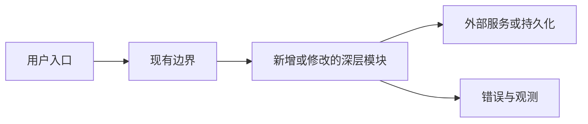

# Plan 表达选择

让表达形式服从需要理解的关系。默认使用 Markdown，并选择能消除歧义的最小形式；通常一份计划只需要零到两个视觉表达。

## 选择规则

| 最难理解的关系 | 优先表达 | 适用条件 |
|---|---|---|
| 字段、接口、方案或 AC 的逐项对应 | 表格 | 至少三项需要横向比较或精确映射 |
| 一个入口影响三个以上组件、调用方或分支 | Mermaid 流程图 | 依赖、责任边界或数据去向难以在线性文字中看清 |
| 异步调用、状态变化、重试、回滚或并发顺序 | Mermaid 时序图或时间线 | 先后关系直接影响正确性 |
| 模块、权限、配置或数据的层级与归属 | 树形结构 | “属于谁、在哪里生效”比执行顺序更重要 |
| 页面区域、窄屏布局或交互位置 | 简洁线框 | 空间关系本身是验收对象 |
| 单一路径、少量编辑、一个明确接口 | 短段落或列表 | 图表不会减少阅读成本 |

不要为了“丰富”而同时画流程图、时序图和表格表达同一件事。表格不要塞入长段落；大型文件清单、测试命令和普通步骤不需要画图。

## 使用要求

- 图中标明入口、关键边界、结果和必要的边含义；区分当前状态与拟议变化。
- 不只依赖颜色传递关键信息。节点名称使用项目真实术语，不发明只有本计划理解的缩写。
- 图后用一到三句话说明读者应看见的关键结论和取舍。
- 表格列只保留决策需要的信息；适合时用“当前 / 变化 / 原因 / 验证”或“AC / 行为 / 入口 / 证据”。
- 线框只表达与需求有关的布局和交互，不追求视觉设计稿精度。
- 若视觉表达无法在聊天中可靠渲染，改用等价的 Markdown 表格、树或紧凑文本。

## 常用骨架

调用或数据流：

接口映射：

| 当前接口 | 计划变化 | 兼容策略 | 验证 |
|---|---|---|---|
| 真实接口或字段 | 可观察变化 | 旧调用方如何继续工作 | 测试或人工入口 |

输出时替换骨架内容；没有形成额外理解价值时不要使用骨架。
